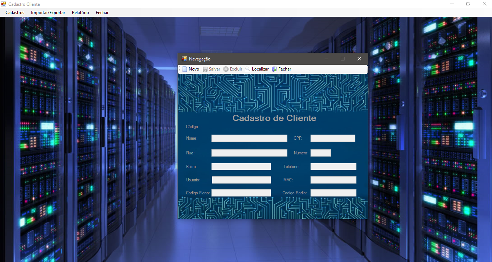
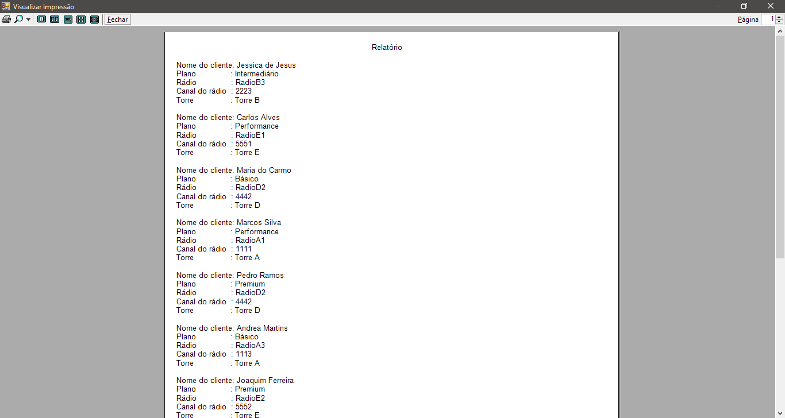

# C# e Windows Forms: Sistema de gerenciamento de uma empresa provedora de internet

  Trabalho proposto na disciplina de Linguagens e Técnicas de Programação II do Curso de Ciência da Computação pela professora Jaqueline, cujo intuito fora desenvolver um programa em C# com Windows Forms e integração com o banco de dados Microsoft SQL Server. Neste caso, foi utilizada a versão 2016 do SQL Server.  
  Realizado em parceria com Willian Mariano, o presente trabalho visara suprir a necessidade de gerenciamento de clientes, planos de internet, dispositivos de rádio e torres de rádio de uma empresa provedora de internet via rádio de uma pequena cidade. Além de operações de cadastro, consulta, alteração e remoção dos itens de gerenciamento anteriormente mencionados, também é possível emitir relatórios de clientes para impressão. 
  Este projeto inclui o scrit de criação do banco de dados. Atente-se à versão do seu banco de dados para evitar problemas de compatibilidade.
 
*TODOS OS DADOS UTILIZADOS SÃO FICTÍCIOS, DESDE NOMES DE PESSOAS, ENDEREÇOS ATÉ CPF. NENHUM DESTES PERTENCEM À ALGUMA PESSOA REAL, TODOS FORAM INVENTADOS PARA FINS DE ESTUDOS. 
*TAMBÉM NÃO POSSUÍMOS QUAISQUER DIREITOS AUTORAIS SOBRE AS IMAGENS UTILIZADAS NO PROJETO, LOGO, FORAM UTILIZADAS SOMENTE PARA FINS DE ESTUDO. 

Capturas de tela: 

